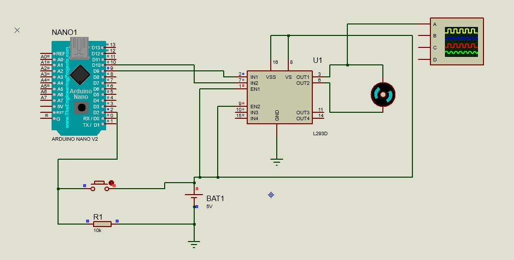

O Projeto foi desenvolvido com arduino no protheus e codado no vscode.



Utilizando arduino nós iremos aumentar a rotação dos motores a cada clique no botão que está sendo alimentado pela porta D2, a cada interação do usuário ele irá aumentar a potência do motor em 64.

Após clicar 3 vezes no botão o ciclo se reinicia, assim voltando ao início.

```
 switch (estado) {
      case 0:
        velocidade = 0;
        break;
      case 1:
        velocidade = 64;
        break;
      case 2:
        velocidade = 128;
        break;
      case 3:
        velocidade = 192;
        break;
    }
```
#

### Contagem de presenças